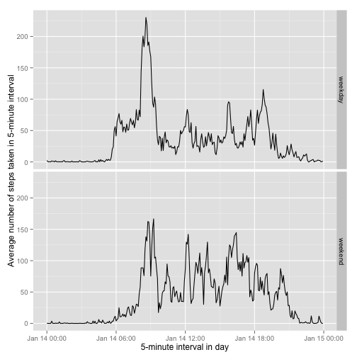

# Reproducible Research: Peer Assessment 1


## Loading and preprocessing the data


```r
# read the data.
# it is assumed that the data file activity.zip is in the current directory.
df <- read.table (unz("./activity.zip", "activity.csv"), header = TRUE, 
                  sep = ",", na.strings = "NA", colClasses = c("numeric", "Date", "numeric"))
```


## What is mean total number of steps taken per day?

### 1. Make a histogram of the total number of steps taken each day

```r
# omit rows with missing data
dfMinusMissingValues <- na.omit (df)
# compute the daily totals
dailySums <- aggregate (dfMinusMissingValues$steps, by=list (date=dfMinusMissingValues$date), FUN=sum)
# plot the histogram
hist (dailySums$x, main="Histogram of Total Number of Steps taken each day", xlab = "Daily Total of Number of Steps", ylab = "Number of Days")
```

 

### 2. Calculate and report the mean and median total number of steps taken per day

Mean total number of steps taken per day is -

```r
# calculate the mean of the daily totals
mean (dailySums$x)
```

```
## [1] 10766
```

Median total number of steps taken per day is -

```r
# calculate the median of the daily totals
median (dailySums$x)
```

```
## [1] 10765
```


## What is the average daily activity pattern?

### 1. Make a time series plot (i.e. type = "l") of the 5-minute interval (x-axis) and the average number of steps taken, averaged across all days (y-axis)


```r
# calculate the averages for each interval
intervalAverages <- aggregate (dfMinusMissingValues$steps, by = list (interval=dfMinusMissingValues$interval), FUN=mean)
# plot the averages for each interval
plot (strptime(sprintf("%04d", intervalAverages$interval), format="%H%M"), intervalAverages$x, type="l", xlab="5-minute interval in day", ylab="Average number of steps taken in 5-minute interval")
```

 
### 2. Which 5-minute interval, on average across all the days in the dataset, contains the maximum number of steps?


```r
head(intervalAverages[with (intervalAverages, order(-intervalAverages$x)),])
```

```
##     interval     x
## 104      835 206.2
## 105      840 195.9
## 107      850 183.4
## 106      845 179.6
## 103      830 177.3
## 101      820 171.2
```

Based on the above result, the answer would be the 08:35 interval.

## Imputing missing values

### 1. Calculate and report the total number of missing values in the dataset (i.e. the total number of rows with NAs)

Total number of missing values in the dataset is - 


```r
sum(is.na(df$steps))
```

```
## [1] 2304
```

### 2. Devise a strategy for filling in all of the missing values in the dataset. The strategy does not need to be sophisticated. For example, you could use the mean/median for that day, or the mean for that 5-minute interval, etc.

Strategy used - mean for that 5-minute interval.

### 3. Create a new dataset that is equal to the original dataset but with the missing data filled in.


```r
dfImputed <- read.table (unz("./activity.zip", "activity.csv"), header = TRUE, sep = ",", 
                         na.strings = "NA", colClasses = c("numeric", "Date", "numeric"))
for (i in 1:nrow (dfImputed)) {
    if (is.na (dfImputed$steps[i])) {
        interval <- dfImputed$interval[i]
        intervalMean <- intervalAverages[intervalAverages$interval == interval, 2]
        dfImputed$steps[i] <- intervalMean
    }
}

head (dfImputed)
```

```
##     steps       date interval
## 1 1.71698 2012-10-01        0
## 2 0.33962 2012-10-01        5
## 3 0.13208 2012-10-01       10
## 4 0.15094 2012-10-01       15
## 5 0.07547 2012-10-01       20
## 6 2.09434 2012-10-01       25
```

```r
tail (dfImputed)
```

```
##        steps       date interval
## 17563 2.6038 2012-11-30     2330
## 17564 4.6981 2012-11-30     2335
## 17565 3.3019 2012-11-30     2340
## 17566 0.6415 2012-11-30     2345
## 17567 0.2264 2012-11-30     2350
## 17568 1.0755 2012-11-30     2355
```

### 4. Make a histogram of the total number of steps taken each day and Calculate and report the mean and median total number of steps taken per day. Do these values differ from the estimates from the first part of the assignment? What is the impact of imputing missing data on the estimates of the total daily number of steps?


```r
dailySumsImputed <- aggregate (dfImputed$steps, by=list (date=dfImputed$date), FUN=sum)
hist (dailySumsImputed$x, main="Histogram of Total Number of Steps taken each day (With Imputed Data)", xlab = "Daily Total of Number of Steps", ylab = "Number of Days")
```

 

```r
mean (dailySumsImputed$x)
```

```
## [1] 10766
```

```r
median (dailySumsImputed$x)
```

```
## [1] 10766
```

These values do not differ from the estimates from the first part of the assignment. There is no / negligible impact of imputing missing data on the estimates.

## Are there differences in activity patterns between weekdays and weekends?


```r
for (i in 1:nrow (dfImputed)) {
    if ((weekdays (dfImputed$date[i]) == "Saturday") ||
        (weekdays (dfImputed$date[i]) == "Sunday")) {
        dfImputed$typeOfDay[i] <- "weekend"
    }
    else {
        dfImputed$typeOfDay[i] <- "weekday"
    }
}

intervalAveragesImputed <- aggregate (dfImputed$steps, by = list (interval=dfImputed$interval, typeOfDay=dfImputed$typeOfDay), FUN=mean)

library (ggplot2)
g <- ggplot (intervalAveragesImputed, aes (x = strptime(sprintf("%04d", intervalAveragesImputed$interval), format="%H%M"), y = intervalAveragesImputed$x))
g + geom_line() + facet_grid (typeOfDay ~ .) + xlab ("5-minute interval in day") + ylab ("Average number of steps taken in 5-minute interval")
```

 

There are some differences in activity patterns between weekdays and weekends.
